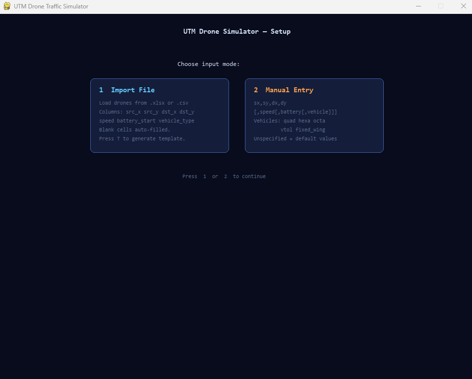
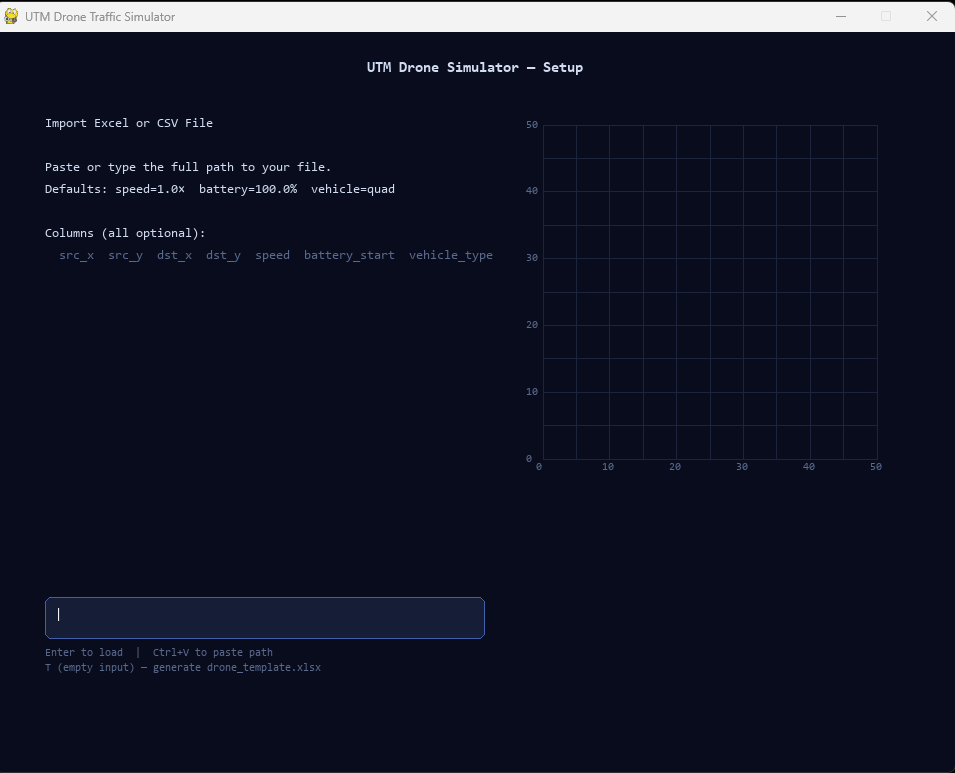
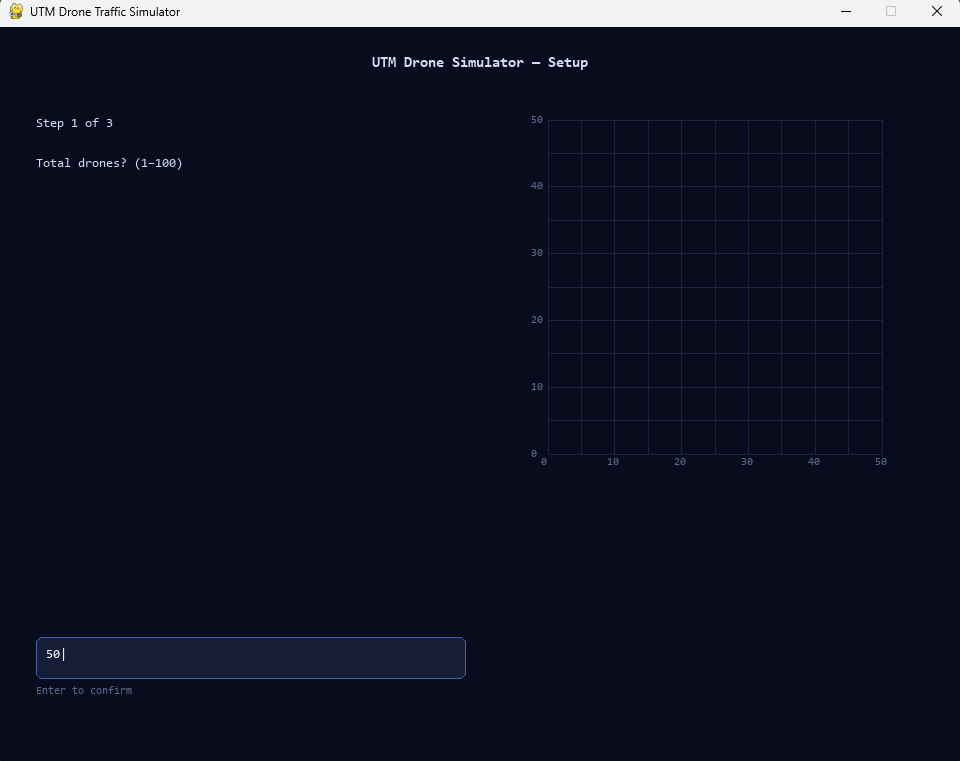
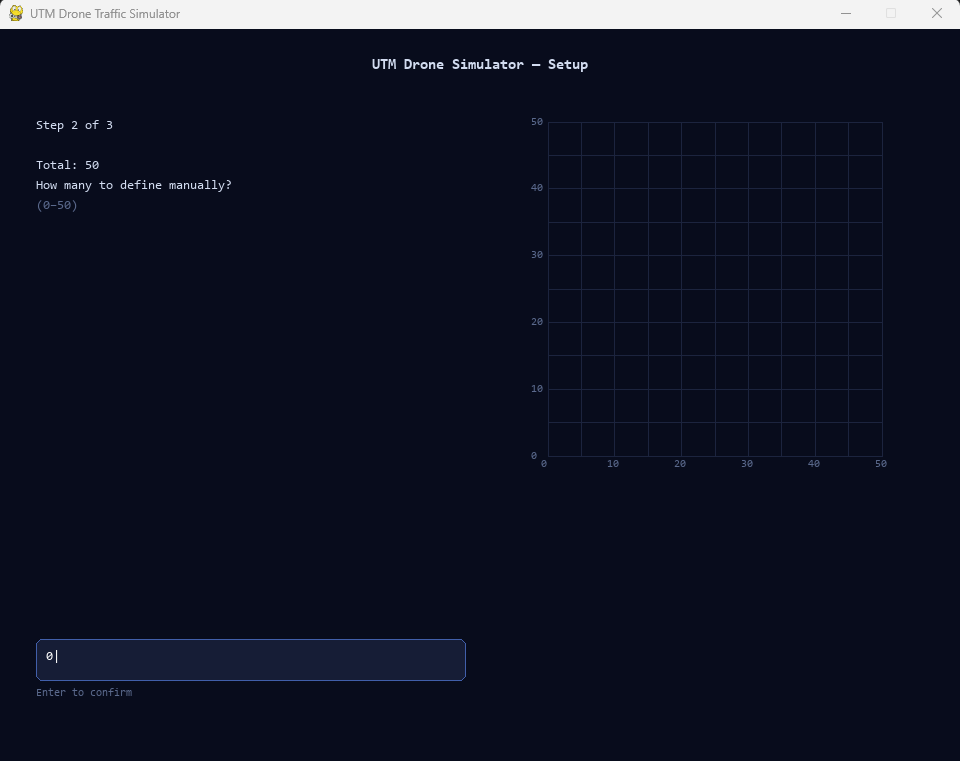
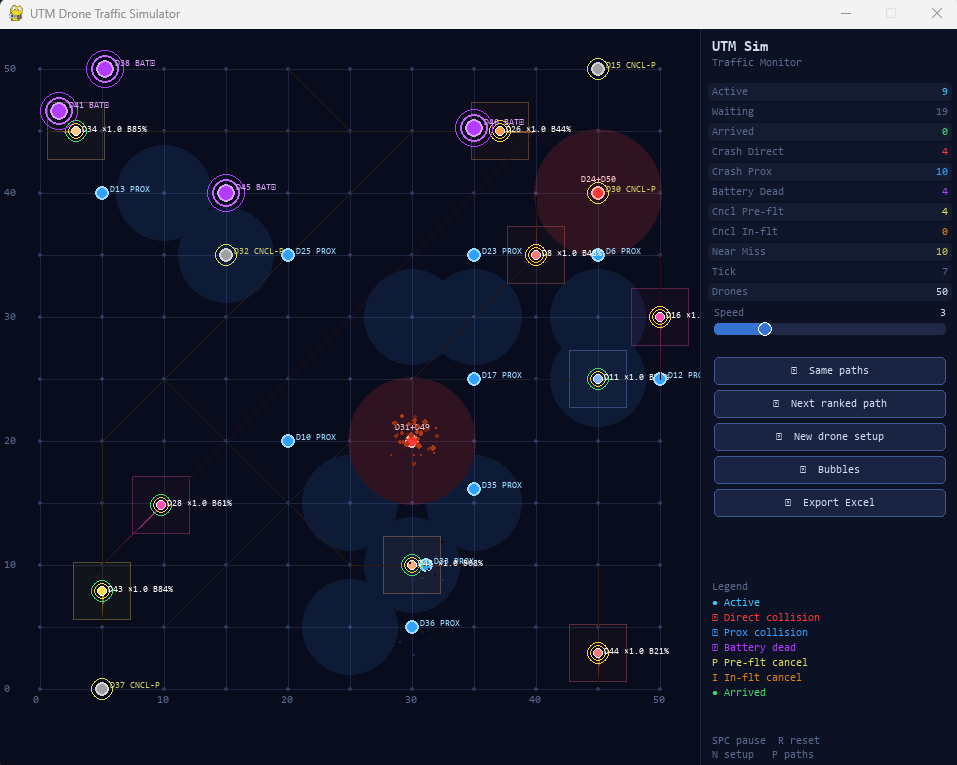
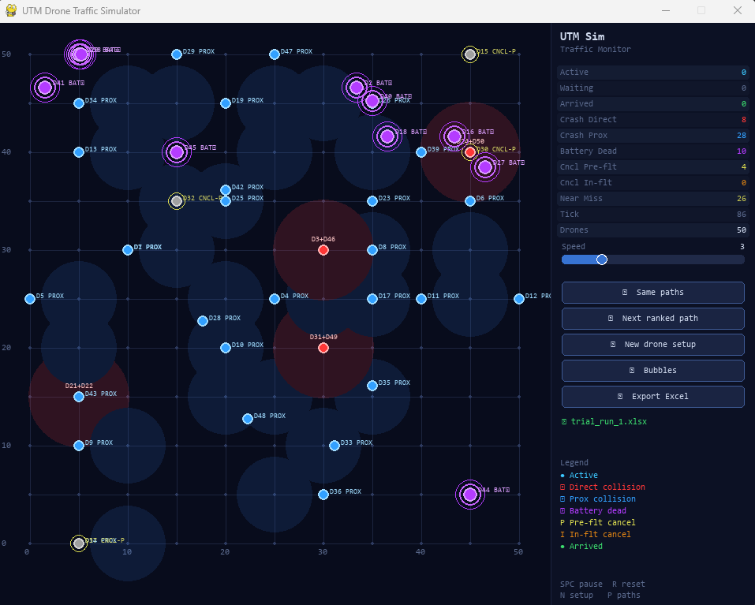

# UTM Drone Traffic Simulator

> **India Urban Air Mobility Research Project — IIT Bombay**
> A real-time 2-D drone airspace simulation built with Python and Pygame.
> Supports multi-drone path planning, collision detection, battery modelling,
> and Excel/CSV export of all collision events.

---

## Setup & Launch

Start the simulator with `python main.py`. The setup screen lets you choose
how to load drone configurations — manually, from a file, or by generating
a blank template.

### Import Choice Screen

Select between manual drone entry or file-based import.



---

## Setup Screens

### File Import

Load drone configurations from an `.xlsx` or `.csv` file.
Type or paste the file path and press `Enter`.
Press `T` with an empty input to generate a blank `drone_template.xlsx`.



---

### Manual Import Configuration

Define drones one at a time — useful for quick experiments without needing a file.



---

### Define Manually

Enter per-drone parameters: source, destination, speed, battery, and vehicle type.



---

## Simulation

Once drones are configured the simulation runs on a 2-D grid. Drones are
rendered with speed rings, battery rings, and collision trails.
The right-side panel shows live stats and speed controls.



---

## Export

Click **⬇ Export Excel** in the panel at any point.
The output workbook has four sheets: Drone Summary, Collision Log, Summary, and By Path Run.



---

## Features

- **Yen's K-Shortest Paths** — each drone pre-computes K ranked loopless
  alternative paths; cycle through them live with the Next Ranked Path button.
- **Dijkstra fallback** — switchable via `config.py` with no other code changes.
- **Cell-based collision detection** — per-vehicle proximity radii, four
  severity levels (Critical / Major / Minor / Near Miss), convergence check
  to avoid false positives on diverging drones.
- **Battery model** — proportional drain; drone stops mid-flight when dead.
- **Random cancellations** — pre-flight (5%) and in-flight (0.8%/tick).
- **Excel export** — four sheets: Drone Summary, Collision Log, Summary, By Path Run.
- **CSV fallback** — works without openpyxl installed.
- **File import** — load drone configs from `.xlsx` or `.csv`.
- **Manual entry** — type drone configs directly in the setup screen.
- **Heatmap** — persistent overlay showing where collisions cluster.
- **Particle VFX** — colored explosion bursts on collision and cancellation.
- **Plugin architecture** — swap pathfinder / collision detector / navigator
  by changing one string in `config.py`.

---

## Tech Stack

| Layer | Library / Tool |
|---|---|
| Language | Python 3.9+ |
| Rendering / UI | [pygame-ce](https://pyga.me/) 2.x |
| Excel export | [openpyxl](https://openpyxl.readthedocs.io/) (optional) |
| CSV import/export | Python standard library `csv` |
| Pathfinding | Custom Dijkstra + Yen's K-Shortest (pure Python) |
| Packaging | No build step — run directly with `python main.py` |

---

## Requirements

```
pygame-ce>=2.5.0
openpyxl>=3.1.0   # optional — needed for Excel export/import
```

Install with:

```bash
pip install pygame-ce openpyxl
```

---

## Quick Start

```bash
git clone https://github.com/your-username/utm-drone-simulator.git
cd utm-drone-simulator/utm_simulator
python main.py
```

---

## Project Structure

```
utm_simulator/
│
├── main.py               # Entry point — pygame loop, mode switching, draw order
├── config.py             # ALL tuneable parameters (edit here only)
├── simulation.py         # Orchestrates drones, collisions, VFX, logging
├── drone.py              # Drone entity: movement, battery, status, rendering
├── grid.py               # Grid ↔ pixel coordinate conversion
├── navigator.py          # Thin shim — delegates to navigation/__init__.py
├── file_loader.py        # Excel / CSV import and template generation
├── logger.py             # Collision event logger → Excel / CSV export
├── vfx.py                # Particle explosion effects and heatmap
│
├── pathfinding/
│   ├── __init__.py       # Factory: get_pathfinder() reads config.PATHFINDER
│   ├── base.py           # BasePathfinder abstract class (contract)
│   ├── dijkstra.py       # Dijkstra shortest path + run_dijkstra() core
│   └── yen.py            # Yen's K-Shortest Loopless Paths
│
├── navigation/
│   ├── __init__.py       # Factory: get_navigator() reads config.NAVIGATOR
│   ├── base.py           # BaseNavigator abstract class (contract)
│   └── ranked.py         # RankedNavigator — cycles through Yen's K paths
│
├── collision/
│   ├── __init__.py       # Factory: get_collision_detector() reads config.COLLISION
│   ├── base.py           # BaseCollisionDetector abstract class (contract)
│   └── cell_based.py     # CellBasedDetector — proximity radii + severity
│
├── ui/
│   ├── grid_renderer.py  # Draws grid lines, node dots, and axis labels
│   ├── panel.py          # Right-side stats panel, buttons, speed slider
│   └── setup.py          # Setup screen — file import or manual drone entry
│
└── simulation_results/   # Excel/CSV output files saved here (auto-created)
```

---

## Configuration

All parameters are in **`config.py`**. You should never need to edit any
other file just to tune the simulation.

| Parameter | Default | Description |
|---|---|---|
| `PATHFINDER` | `"yen"` | `"yen"` or `"dijkstra"` |
| `COLLISION` | `"cell_based"` | Collision detection model |
| `NAVIGATOR` | `"ranked"` | Navigation strategy |
| `K_PATHS` | `10` | Number of ranked paths per drone |
| `GRID_UNITS` | `50` | Airspace size in grid units |
| `STEP` | `5` | Distance between grid nodes |
| `FPS` | `60` | Target frame rate |
| `CANCEL_PREFLIGHT_PROB` | `0.05` | Pre-flight cancellation probability |
| `CANCEL_INFLIGHT_PROB` | `0.008` | In-flight cancellation probability per tick |
| `DEFAULT_BATTERY` | `100.0` | Default battery start % |
| `VEHICLE_PROXIMITY_RADIUS` | see config | Per-vehicle safety bubble (grid units) |

---

## Keyboard Shortcuts (Simulation Mode)

| Key | Action |
|---|---|
| `SPACE` | Pause / resume |
| `R` | Restart — same path, same rank |
| `P` | Cycle all drones to next ranked path |
| `N` | Return to setup screen |

---

## Drone Status Visual Guide

| Status | Visual |
|---|---|
| Active | Colored dot + speed ring + battery ring + trail |
| Arrived | Hidden |
| Crash — Direct | Red dot |
| Crash — Proximity | Blue dot |
| Incomplete — Battery | Purple dot with three rings |
| Cancelled Pre-flight | Grey dot + yellow ring, label `CNCL-P` |
| Cancelled In-flight | Orange dot, label `CNCL-I` |

---

## Importing Drone Configs

### Excel / CSV

1. Press `1` on the setup screen to choose file import.
2. Type or paste the file path and press `Enter`.
3. Press `T` (with empty input) to generate a blank `drone_template.xlsx`.

**Required columns:** `src_x`, `src_y`, `dst_x`, `dst_y`

**Optional columns** (blank = default):

| Column | Values | Default |
|---|---|---|
| `speed` | 0.1 – 5.0 | 1.0 |
| `battery_start` | 0 – 100 | 100 |
| `vehicle_type` | quad / hexa / octa / vtol / fixed_wing | quad |

### Manual Entry

1. Press `2` on the setup screen.
2. Enter total drone count, then how many to define manually.
3. For each manual drone, type: `sx,sy,dx,dy[,speed[,battery[,vehicle]]]`

---

## Excel Export

Click **⬇ Export Excel** in the panel (or let it auto-name as `trial_run_N`).

The output file has four sheets:

| Sheet | Contents |
|---|---|
| Drone Summary | One row per drone with full status, timing, battery, distances |
| Collision Log | One row per collision/near-miss event with coordinates |
| Summary | Aggregate counts (drones, collisions, path runs) |
| By Path Run | Collision breakdown per ranked-path trial |

---

## Extending the Simulator

### Add a new pathfinding algorithm

```python
# 1. Create pathfinding/myalgo.py
from pathfinding.base import BasePathfinder

class MyAlgo(BasePathfinder):
    def compute_paths(self, src, dst, k=None): ...
    def path_cost(self, path): ...

# 2. Register in pathfinding/__init__.py
from pathfinding.myalgo import MyAlgo
# Add elif branch in get_pathfinder()

# 3. Set in config.py
PATHFINDER = "myalgo"
```

### Add a new collision model

```python
# 1. Create collision/mymodel.py
from collision.base import BaseCollisionDetector

class MyModel(BaseCollisionDetector):
    def detect(self, drone_a, drone_b) -> str:
        # Return "direct" | "major" | "minor" | "near_miss" | "none"
        ...

# 2. Register in collision/__init__.py
# 3. Set in config.py: COLLISION = "mymodel"
```

### Add a new drone field

```python
# In config.py, add one entry to DRONE_FIELDS:
{
    "name"      : "priority",        # column header in import files
    "default"   : 1,                 # value when blank
    "parse"     : lambda v: int(v),  # validation function
    "drone_attr": "priority",        # attribute set on Drone object
    "log"       : True,
    "display"   : "Mission priority (1–5)",
}
# The field now appears in file imports, manual entry, and Excel export
# automatically. No other file needs editing.
```

---

## Research Context

This simulator was built for the **UTM Geo Corridor Simulator** project at
IIT Bombay as part of Urban Air Mobility (UAM) research. It generates
multi-vehicle drone flight trials and records collision events, battery
consumption, and route efficiency — data that feeds directly into the
[UTM Command Dashboard](../utm_v10_FINAL/) for analysis.

---

## License

MIT — see `LICENSE` for details.
